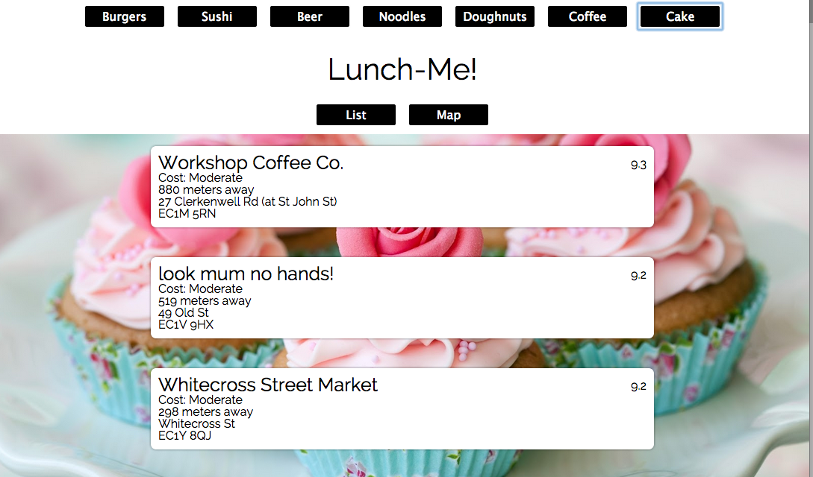

Lunch Me
=======

Don't know where to eat today?
Try our app!

[Feed Me](http://www.feedme.london/)



## Objectives
Learning how to make API calls to the [Foursquare API](https://developer.foursquare.com/start) using JQuery and Ajax. With the data returned in JSON we used a Mustache template to render the results and then attached it to the DOM.

We also used the HTML5 geolocation to get the current position of the browser and used [GMaps.js](http://hpneo.github.io/gmaps/) to display the location of the results on google maps.

## What to do
Take out the logic of the API calls and parsing of data into seperate Javascript objects and TDD those using Jasmine. Since we were playing around, we left it all in the presentation layer.

## Tech Stack
* Javascript
* JQuery
* AJAX
* {{ Handlebars.js }}
* Sinatra
* Ruby
* puma
* ~~GMaps~~

## APIS
* Foursquare
* ~~Google Maps~~

## How to run it
```sh
git clone https://github.com/csharpd/feedme.git
cd feedme
bundle
rackup
```
open your browser and go to [localhost:9292](http://localhost:9292)

## My  Pairing Partner
[ecomba](https://github.com/ecomba)
